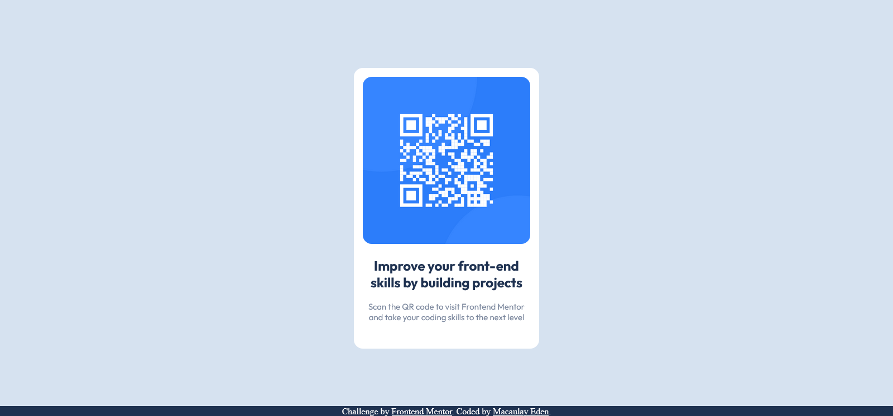

# Frontend Mentor - QR code component solution

This is a solution to the [QR code component challenge on Frontend Mentor](https://www.frontendmentor.io/challenges/qr-code-component-iux_sIO_H). Frontend Mentor challenges help you improve your coding skills by building realistic projects. 

## Table of contents

- [Overview](#overview)
  - [Screenshot](#screenshot)
  - [Links](#links)
- [My process](#my-process)
  - [What I learned](#what-i-learned)
  - [Continued development](#continued-development)

## Overview

### Screenshot

### Links

- Live Site URL: [Add live site URL here](https://edenexperiments.github.io/Frontend-Mentor-QR-Component/)

## My process

### What I learned

I started with a simple project to get use to front-end mentor and practice some basic HTML/CSS. Was a good practice of using Git again too and GitHub Pages. 

### Continued development

Going to continue with a sligtly harder project to continue practicing the HTML and CSS basics.

